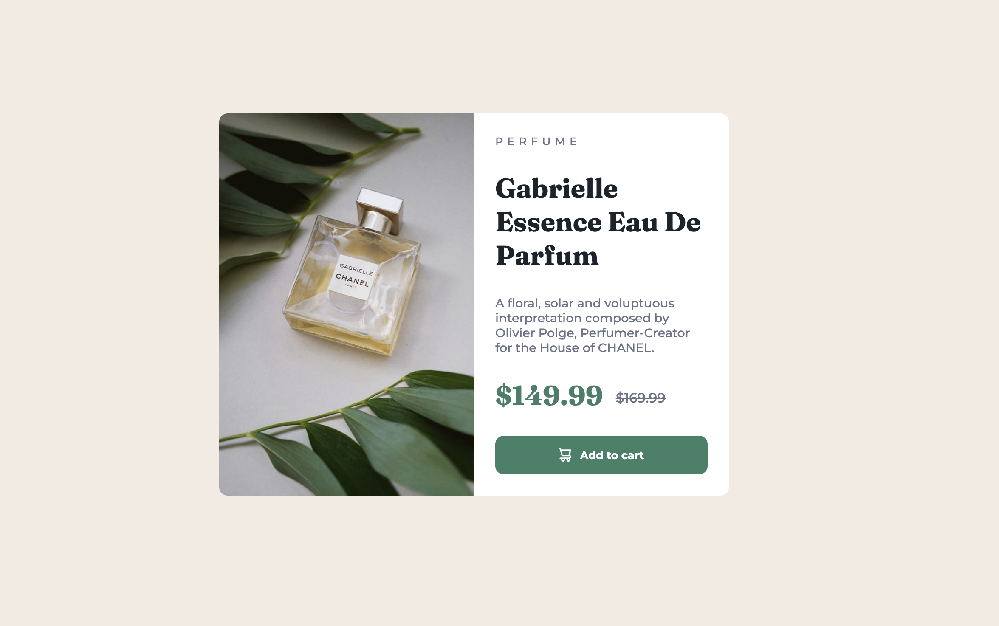

# Frontend Mentor - Product preview card component solution - coded by Alez05

## Table of contents

- [Overview](#overview)
- [Screenshot](#screenshot)
- [Links](#links)
- [Built with](#built-with)
- [What I learned](#what-i-learned)
- [Continued development](#continued-development)
- [Author](#author)

## Overview

### Screenshot

### Links

- Solution URL: [Add solution URL here](https://your-solution-url.com)
- Live Site URL: [Add live site URL here](https://your-live-site-url.com)

## My process

### Built with

- Semantic HTML5 markup
- CSS custom properties
- Flexbox
- CSS Grid

### What I learned

This was an easy task, but I must say I was not really familiar with css variables, and I have learned how to make use of them in this project.

`
:root {
/_Primary_/
--dark-cyan: hsl(158, 36%, 37%);
--cream: hsl(30, 38%, 92%);

/_Neutral_/
--dark-blue: hsl(212, 21%, 14%);
--grayish-blue: hsl(228, 12%, 48%);
--White: hsl(0, 0%, 100%);
--darker-cyan: hsl(158, 36%, 25%);
}
`

### Continued development

I will continue to learn more about css variables and how to use them in my projects. And I will try to make use more of rem instead of px, because it s a better way to make responsive websites.

## Author

- Website - 
- Frontend Mentor - [@Alez05](https://www.frontendmentor.io/profile/Alez05)
- Twitter - [@buzzlo](https://www.twitter.com/buzzlo)
- Github - [@Alez05](https://github.com/Alez05)
